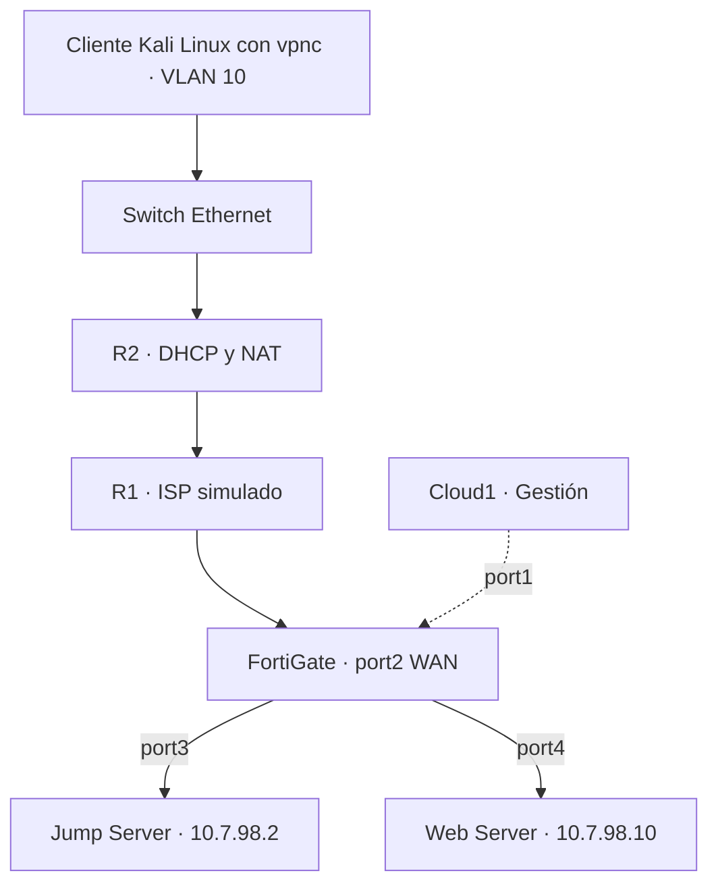

## Video demostrativo

https://youtu.be/fGpYtLA6BZM

El video debe presentar la configuración mediante GUI del FortiGate, la conexión desde Kali con vpnc, los accesos de los dos perfiles y RemoteApp desde Firefox. 
# Laboratorio de acceso remoto con FortiGate VPN y RemoteApp

**Autor:** Emmanuel Orlando Rodríguez Núñez  
**Matrícula:** 20250798  
**Institución:** Instituto Tecnológico de Las Américas  
**Plataforma:** GNS3

## Propósito

Implementar una red segmentada en la que los usuarios acceden por VPN a un Jump Server. Este servidor concentra el acceso al Web Server mediante HTTPS, SSH y RDP. Las aplicaciones publicadas en RemoteApp se asignan según el perfil de cada usuario.

La documentación describe la arquitectura y la configuración del laboratorio. Las capturas y los resultados nuevos quedan pendientes; no se considera demostrado el funcionamiento por la sola descripción de la configuración.

## Documentación técnica

- [Consultar el informe técnico en PDF](docs/Documentacion_tecnica_FortiGate.pdf).
- [Descargar el informe técnico editable en Word](docs/Documentacion_tecnica_FortiGate.docx).
- [Consultar las capturas de configuración](images/).
- [Consultar los diagramas](diagrams/).


## Componentes del laboratorio

| Componente | Función |
| --- | --- |
| R1 Cisco | ISP simulado y enlace hacia la WAN del FortiGate. |
| R2 Cisco | Gateway de VLAN 10, DHCP y NAT con sobrecarga. |
| Switch Ethernet de GNS3 | Conexión de los clientes en VLAN 10 y enlace dot1q hacia R2. |
| FortiGate | VPN IPsec, separación de las LAN y políticas de acceso. |
| Jump Server con Windows Server 2022 | Acceso remoto y publicación de aplicaciones con RDS, RemoteApp y Web Client. |
| Web Server | Sistema de Caja y servicios HTTPS, SSH y RDP descritos en la guía. |
| Cliente Kali Linux (vpnc) | VPN con vpnc 0.5.3, VLAN 10 por DHCP y Firefox para RD Web Client; perfiles básico y privilegiado. |
| Cloud1 | Acceso de gestión al FortiGate mediante port1. |


## Topología



Kali establece la VPN contra `20.25.98.2` mediante vpnc. El FortiGate termina el túnel y controla el acceso al Jump. Las dos LAN de servidores utilizan interfaces y subredes independientes.

## Direccionamiento

| Segmento | Red | Direcciones asignadas |
| --- | --- | --- |
| ISP entre R1 y R2 | `20.25.7.0/30` | R1 f0/0: `20.25.7.1`; R2 f0/0: `20.25.7.2`. |
| ISP hacia FortiGate | `20.25.98.0/30` | R1 g1/0: `20.25.98.1`; FortiGate port2: `20.25.98.2`. |
| Usuarios VLAN 10 | `10.20.25.0/25` | R2 g1/0.10: `10.20.25.1`; DHCP: `10.20.25.10` a `10.20.25.126`. |
| LAN Jump Server | `10.7.98.0/29` | FortiGate port3: `10.7.98.1`; Jump: `10.7.98.2`. |
| LAN Web Server | `10.7.98.8/29` | FortiGate port4: `10.7.98.9`; Web: `10.7.98.10`. |
| Clientes VPN | Pool `10.20.25.128/25`; IP de interfaz `/32` | `tun0`: IP del rango `10.20.25.130` a `10.20.25.170`, según la sesión. |
| Gestión del FortiGate | `192.168.23.0/24` | port1: `192.168.23.152`. |
| Loopback del ISP | `8.8.8.8/32` | R1 Loopback0. |

Kali obtiene la IP física en `eth0` por DHCP: **[PENDIENTE: IP DHCP de Kali]**. `tun0` recibe una dirección `/32`, por ejemplo `10.20.25.130/32` o `10.20.25.131/32`; **[PENDIENTE: IP de tun0 de la sesión documentada]**. La máscara `/25` vista en el adaptador del cliente anterior no aplica al túnel de Linux.

La tabla NAT de la Figura 5 es histórica: su origen '10.20.25.11' 

Las direcciones `20.25.x.x` representan los enlaces públicos dentro de la simulación. La dirección `8.8.8.8` está configurada como loopback de R1.

## Configuración de red

R2 termina VLAN 10 mediante `encapsulation dot1Q 10`, entrega direcciones con el pool `USUARIOS_V10` y utiliza `10.20.25.1` como gateway. El NAT con sobrecarga traduce la red de usuarios a `20.25.7.2`. Su ruta por defecto apunta a `20.25.7.1`.

En el FortiGate, la ruta por defecto utiliza `20.25.98.1` mediante `WAN-ISP (port2)`. Las interfaces `lan-jump (port3)` y `lan-web (port4)` actúan como gateways de sus servidores. La configuración y la demostración del FortiGate se realizan mediante GUI.

## VPN y perfiles de usuario

El túnel `VPN-REMOTE` se asocia con port2 y utiliza el pool `10.20.25.130` a `10.20.25.170`. El destino autorizado del acceso remoto es el Jump Server `10.7.98.2`.

| Perfil | Cuenta | Grupo del FortiGate | Acceso VPN al Jump | Aplicaciones asignadas en RemoteApp |
| --- | --- | --- | --- | --- |
| Básico | `usr_basico` | `grp_vpn_basico` | HTTPS. | Navegador Web. |
| Privilegiado | `usr_priv` | `grp_vpn_priv` | HTTPS y RDP. | Navegador Web, PuTTY y Escritorio remoto. |

El grupo `grp-vpn-all` incluye ambas cuentas para la autenticación VPN. La guía describe los grupos de Windows `GG-RA-BASICO` y `GG-RA-PRIV` para asignar las aplicaciones. Las cuentas del FortiGate y de Windows pertenecen a sistemas de autenticación distintos.


### Parámetros actuales de vpnc

| Parámetro | Valor documentado |
| --- | --- |
| SO y cliente | Kali Linux, vpnc 0.5.3. [PENDIENTE: salida completa de `vpnc --version`]. |
| Negociación | IPsec IKEv1, modo agresivo, PSK + XAuth, NAT-T. |
| Gateway e identificador | `20.25.98.2`; IPSec ID `vpnc-lab`. |
| Archivo | `/etc/vpnc/fortigate-lab.conf`; sin secretos en la versión pública. |
| Túnel | `tun0`, dirección `/32` del pool `10.20.25.130–10.20.25.170`. |
| Split tunnel | Destino autorizado `10.7.98.2/32`, `jumblab.lab.local`. |
| Fase 1 | `des-sha1`, observada según la actualización aportada. |
| Fase 2 | [PENDIENTE: confirmar propuesta final y cambio exacto]. `aes256-sha1` es un ejemplo, no un resultado confirmado. |
| Selectores y PFS | [PENDIENTE: confirmar valores finales en GUI]. |

`des-sha1` es la negociación reportada para esta práctica. Se informan limitaciones del vpnc 0.5.3 utilizado para SHA256 y DH14 completo; las compilaciones posteriores pueden variar. DES no es el único cifrado de vpnc y esta propuesta no demuestra incompatibilidad con AES. Se recomienda, como mejora futura, strongSwan con AES/SHA256/DH14 compatibles en ambos extremos. Esta recomendación no describe una configuración aplicada.

## Políticas del FortiGate

| Política | Flujo | Servicio | Acción |
| --- | --- | --- | --- |
| `DENY-SSH-BASICO` | VPN del perfil básico hacia Jump. | SSH. | DENY. |
| `VPN-BASICO-A-JUMP` | VPN del perfil básico hacia Jump. | `SG-VPN-BASICO`: HTTPS. | ACCEPT. |
| `VPN-PRIV-A-JUMP` | VPN del perfil privilegiado hacia Jump. | `SG-VPN-PRIV`: HTTPS y RDP. | ACCEPT. |
| `JUMP-A-WEB` | Jump en port3 hacia Web en port4. | `SG-JUMP-A-WEB`: HTTPS, RDP y SSH. | ACCEPT. |
| `DENY-SSH-BASICO2` | VPN del perfil básico hacia Web. | SSH. | DENY. |
| `test` | VPN hacia Jump. | ALL. | Deshabilitada. |
| `Implicit Deny` | Tráfico sin coincidencia con una regla de permiso. | ALL. | DENY. |

La captura documenta NAT desactivado en las reglas de aceptación y ninguna regla ACCEPT desde VPN-REMOTE hacia la LAN Web. El cierre visible es una denegación implícita. La asignación de aplicaciones dentro del Jump se controla en RemoteApp. **[PENDIENTE: confirmar si se añadió `DENY-ALL` o se habilitó `fwpolicy-implicit-log`]**. La matriz conserva el cierre observado hasta recibir evidencia GUI del cambio.


## Servicios y aplicaciones

| Servicio | Destino | Uso |
| --- | --- | --- |
| HTTPS, TCP 443 | Jump y Web Server. | Portal de acceso remoto y sitio Sistema de Caja. |
| SSH, TCP 22 | Web Server desde Jump. | Administración mediante PuTTY para el perfil privilegiado. |
| RDP, TCP 3389 | Jump y Web Server. | Acceso remoto y conexión mediante la aplicación publicada. |

El sitio del Web Server se identifica como `https://10.7.98.10`. La guía describe una página de Apache denominada Sistema de Caja. El acceso a RemoteApp se organiza mediante `https://jumblab.lab.local/RDWeb` y `https://jumblab.lab.local/RDWeb/webclient`, con resolución de `jumblab.lab.local` hacia `10.7.98.2`.


## RD Gateway Web Client y certificados

Según la actualización aportada, `Get-RDServer` lista `RDS-RD-SERVER`, `RDS-CONNECTION-BROKER`, `RDS-WEB-ACCESS` y `RDS-GATEWAY`. RD Gateway está instalado y `GatewayExternalFqdn = jumblab.lab.local`. En este despliegue permite abrir la sesión del Web Client por WebSocket seguro sobre TCP 443. Cargar la lista de apps no prueba que la sesión funcione.

`Get-RDWebClientPackage` informa el paquete `rd-html5`, versión `2.1.85.0`, publicado como `Production`. El certificado RDS es autofirmado y `Get-RDCertificate` informa Level **No es de confianza**. Se importó el certificado público en las autoridades de Firefox en Kali. 

```powershell
# Consultas en el Jump Server
Get-RDServer
Get-RDDeploymentGatewayConfiguration
Get-RDCertificate
Get-RDWebClientPackage
```

## Configuración del cliente Kali

La entrada de `/etc/hosts` es:

```text
10.7.98.2 jumblab.lab.local
```

Archivo usado: `/etc/vpnc/fortigate-lab.conf`. Esquema público de referencia, con líneas de secretos omitidas; no equivale a una exportación real:

```text
IPSec gateway 20.25.98.2
IPSec ID vpnc-lab
IKE Authmode psk
Xauth username usr_basico
# Para el otro perfil: Xauth username usr_priv
# [PENDIENTE: opciones reales de NAT-T, DES, DH, PFS y rutas]
```

```bash
sudo vpnc --no-detach --debug 1 /etc/vpnc/fortigate-lab.conf
ip a show eth0
ip a show tun0
ip route get 10.7.98.2
curl -kI --connect-timeout 5 https://jumblab.lab.local/RDWeb/
nc -zv -w 5 10.7.98.2 443
ssh -o ConnectTimeout=5 usr_basico@10.7.98.2
xfreerdp /v:jumblab.lab.local /u:usr_priv /d:lab.local
firefox https://jumblab.lab.local/RDWeb/webclient
# Al terminar la sesión
sudo vpnc-disconnect
```

Para comprobar el bloqueo directo al Web Server con split tunnel:

```bash
sudo ip route add 10.7.98.10/32 dev tun0
ip route get 10.7.98.10
curl -kI --connect-timeout 5 https://10.7.98.10
nc -zv -w 5 10.7.98.10 3389
ssh -o ConnectTimeout=5 usr_basico@10.7.98.10
# Retirar la ruta de prueba
sudo ip route del 10.7.98.10/32 dev tun0
```

La ruta no concede acceso ni modifica los selectores IPsec. Si Fase 2 solo acepta el Jump, el tráfico al Web puede descartarse antes de la política. Para acreditar `DENY-SSH-BASICO2`, verificar llegada al firewall, perfil XAuth y política mediante Forward Traffic en GUI. El usuario del comando SSH no cambia la identidad VPN.


Para `JUMP-A-WEB`, el origen es `10.7.98.2`; no se infiere el usuario del RemoteApp en Source User. Correlacionar la sesión RDS. Un timeout aislado o la ausencia de log no demuestran una política específica; confirmar trayecto, selector y regla.

## Organización del repositorio

| Ruta | Contenido |

| `README.md` | Video, propósito, arquitectura y navegación. |
| `images/` | Capturas de la topología y de la configuración. |
| `configs/` | Running-configs reales de R1 y R2 y respaldo del FortiGate. |


