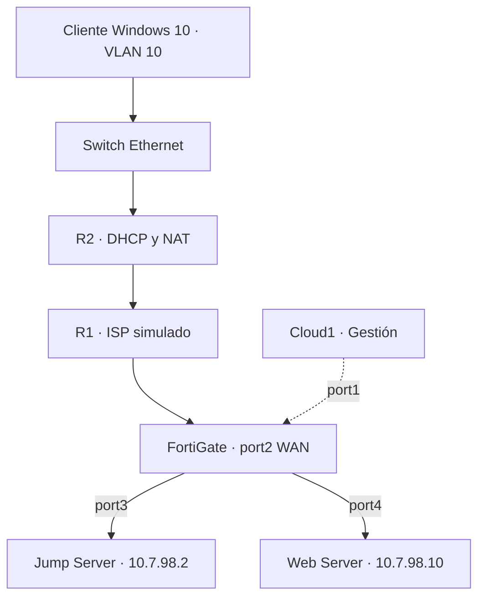

[README.md](https://github.com/user-attachments/files/33260800/README.md)
## Video demostrativo

**[Ver la demostración del laboratorio](PEGAR_AQUI_EL_ENLACE_DEL_VIDEO)**

<!-- Reemplazar PEGAR_AQUI_EL_ENLACE_DEL_VIDEO por la URL real antes de publicar. -->

El video presenta la configuración mediante GUI del FortiGate, la conexión VPN, los accesos de los dos perfiles y el uso de RemoteApp y del Web Server.

# Laboratorio de acceso remoto con FortiGate VPN y RemoteApp

**Autor:** Emmanuel Orlando Rodríguez Núñez  
**Matrícula:** 20250798  
**Institución:** Instituto Tecnológico de Las Américas  
**Plataforma:** GNS3

## Propósito

Implementar una red segmentada en la que los usuarios acceden por VPN a un Jump Server. Este servidor concentra el acceso al Web Server mediante HTTPS, SSH y RDP. Las aplicaciones publicadas en RemoteApp se asignan según el perfil de cada usuario.

La documentación describe la arquitectura y la configuración del laboratorio. El video complementa el informe con la demostración del funcionamiento.

## Documentación técnica

- [Consultar el informe técnico en PDF](docs/Documentacion_tecnica_FortiGate.pdf).
- [Descargar el informe técnico editable en Word](docs/Documentacion_tecnica_FortiGate.docx).
- [Consultar las capturas de configuración](images/).
- [Consultar los diagramas](diagrams/).

El informe contiene el plan de direccionamiento, la configuración Cisco, las interfaces y políticas del FortiGate, la configuración descrita de los servidores y los anexos de referencia. Incluye las diez imágenes del PDF original de infraestructura y las capturas adicionales relevantes.

## Componentes del laboratorio

| Componente | Función |
| --- | --- |
| R1 Cisco | ISP simulado y enlace hacia la WAN del FortiGate. |
| R2 Cisco | Gateway de VLAN 10, DHCP y NAT con sobrecarga. |
| Switch Ethernet de GNS3 | Conexión de los clientes en VLAN 10 y enlace dot1q hacia R2. |
| FortiGate | VPN IPsec, separación de las LAN y políticas de acceso. |
| Jump Server con Windows Server 2022 | Acceso remoto y publicación de aplicaciones con RDS, RemoteApp y Web Client. |
| Web Server | Sistema de Caja y servicios HTTPS, SSH y RDP descritos en la guía. |
| Cliente Windows 10 | Conexión a VLAN 10 y acceso remoto con los perfiles básico y privilegiado. |
| Cloud1 | Acceso de gestión al FortiGate mediante port1. |

La topología contiene una VM cliente que se utiliza para los dos perfiles de usuario. El esquema del Web Server utiliza Ubuntu, Apache, OpenSSH y xrdp.

## Topología

El cliente establece la VPN contra `20.25.98.2`. El FortiGate termina el túnel y controla el acceso al Jump. Las dos LAN de servidores utilizan interfaces y subredes independientes.

## Direccionamiento

| Segmento | Red | Direcciones asignadas |
| --- | --- | --- |
| ISP entre R1 y R2 | `20.25.7.0/30` | R1 f0/0: `20.25.7.1`; R2 f0/0: `20.25.7.2`. |
| ISP hacia FortiGate | `20.25.98.0/30` | R1 g1/0: `20.25.98.1`; FortiGate port2: `20.25.98.2`. |
| Usuarios VLAN 10 | `10.20.25.0/25` | R2 g1/0.10: `10.20.25.1`; DHCP: `10.20.25.10` a `10.20.25.126`. |
| LAN Jump Server | `10.7.98.0/29` | FortiGate port3: `10.7.98.1`; Jump: `10.7.98.2`. |
| LAN Web Server | `10.7.98.8/29` | FortiGate port4: `10.7.98.9`; Web: `10.7.98.10`. |
| Clientes VPN | `10.20.25.128/25` | Pool: `10.20.25.130` a `10.20.25.170`. |
| Gestión del FortiGate | `192.168.23.0/24` | port1: `192.168.23.152`. |
| Loopback del ISP | `8.8.8.8/32` | R1 Loopback0. |

Las direcciones `20.25.x.x` representan los enlaces públicos dentro de la simulación. La dirección `8.8.8.8` está configurada como loopback de R1.

## Configuración de red

R2 termina VLAN 10 mediante `encapsulation dot1Q 10`, entrega direcciones con el pool `USUARIOS_V10` y utiliza `10.20.25.1` como gateway. El NAT con sobrecarga traduce la red de usuarios a `20.25.7.2`. Su ruta por defecto apunta a `20.25.7.1`.

En el FortiGate, la ruta por defecto utiliza `20.25.98.1` mediante `WAN-ISP (port2)`. Las interfaces `lan-jump (port3)` y `lan-web (port4)` actúan como gateways de sus servidores. La configuración y la demostración del FortiGate se realizan mediante GUI.

## VPN y perfiles de usuario

El túnel `VPN-REMOTE` se asocia con port2 y utiliza el pool `10.20.25.130` a `10.20.25.170`. El destino autorizado del acceso remoto es el Jump Server `10.7.98.2`.

| Perfil | Cuenta | Grupo del FortiGate | Acceso VPN al Jump | Aplicaciones asignadas en RemoteApp |
| --- | --- | --- | --- | --- |
| Básico | `usr_basico` | `grp_vpn_basico` | HTTPS. | Navegador Web. |
| Privilegiado | `usr_priv` | `grp_vpn_priv` | HTTPS y RDP. | Navegador Web, PuTTY y Escritorio remoto. |

El grupo `grp-vpn-all` incluye ambas cuentas para la autenticación VPN. La guía describe los grupos de Windows `GG-RA-BASICO` y `GG-RA-PRIV` para asignar las aplicaciones. Las cuentas del FortiGate y de Windows pertenecen a sistemas de autenticación distintos.

## Políticas del FortiGate

| Política | Flujo | Servicio | Acción |
| --- | --- | --- | --- |
| `DENY-SSH-BASICO` | VPN del perfil básico hacia Jump. | SSH. | DENY. |
| `VPN-BASICO-A-JUMP` | VPN del perfil básico hacia Jump. | `SG-VPN-BASICO`: HTTPS. | ACCEPT. |
| `VPN-PRIV-A-JUMP` | VPN del perfil privilegiado hacia Jump. | `SG-VPN-PRIV`: HTTPS y RDP. | ACCEPT. |
| `JUMP-A-WEB` | Jump en port3 hacia Web en port4. | `SG-JUMP-A-WEB`: HTTPS, RDP y SSH. | ACCEPT. |
| `DENY-SSH-BASICO2` | VPN del perfil básico hacia Web. | SSH. | DENY. |
| `test` | VPN hacia Jump. | ALL. | Deshabilitada. |
| `Implicit Deny` | Tráfico sin coincidencia con una regla de permiso. | ALL. | DENY. |

La captura documenta NAT desactivado en las reglas de aceptación y ninguna regla ACCEPT desde VPN-REMOTE hacia la LAN Web. El cierre visible es una denegación implícita. La asignación de aplicaciones dentro del Jump se controla en RemoteApp.

## Servicios y aplicaciones

| Servicio | Destino | Uso |
| --- | --- | --- |
| HTTPS, TCP 443 | Jump y Web Server. | Portal de acceso remoto y sitio Sistema de Caja. |
| SSH, TCP 22 | Web Server desde Jump. | Administración mediante PuTTY para el perfil privilegiado. |
| RDP, TCP 3389 | Jump y Web Server. | Acceso remoto y conexión mediante la aplicación publicada. |

El sitio del Web Server se identifica como `https://10.7.98.10`. La guía describe una página de Apache denominada Sistema de Caja. El acceso a RemoteApp se organiza mediante `https://jump.lab.local/RDWeb` y `https://jump.lab.local/RDWeb/webclient`, con resolución de `jump.lab.local` hacia `10.7.98.2`.

## Organización del repositorio

| Ruta | Contenido |
| --- | --- |
| `README.md` | Video, propósito, arquitectura y navegación. |
| `docs/` | Documentación técnica en PDF y Word. |
| `images/` | Capturas de la topología y de la configuración. |
| `diagrams/` | Diagramas de topología lógica y flujos de acceso. |
| `configs/` | Running-configs reales de R1 y R2 y respaldo del FortiGate. |
| `scripts/` | Scripts y archivos efectivamente utilizados en los servidores. |
| `video/` | Material complementario o referencia al video. |

## Archivos de configuración y scripts

Las exportaciones reales de los routers deben incorporarse en `configs/` como `R1-running-config.txt` y `R2-running-config.txt`. El respaldo del FortiGate se obtiene desde la GUI. Los comandos de referencia incluidos en los anexos del informe no sustituyen estas exportaciones.

En `scripts/` se conservan los archivos utilizados para configurar el Web Server y el Jump Server, como Netplan, el contenido Web y los scripts de Bash o PowerShell. Las contraseñas, la clave precompartida y los certificados con claves privadas se excluyen de la versión pública.

## Preparación de la entrega

1. Colocar este `README.md` en la raíz del repositorio y conservar las carpetas del paquete adjunto.
2. Sustituir `PEGAR_AQUI_EL_ENLACE_DEL_VIDEO` por la dirección real del video.
3. Incorporar los running-configs, el respaldo del FortiGate y los scripts reales en sus carpetas.
4. Subir el conjunto al repositorio y comprobar los enlaces desde su página principal.

La documentación se elaboró con la guía de la práctica, el PDF de infraestructura y las capturas complementarias. La demostración de los accesos y restricciones se presenta en el video.
